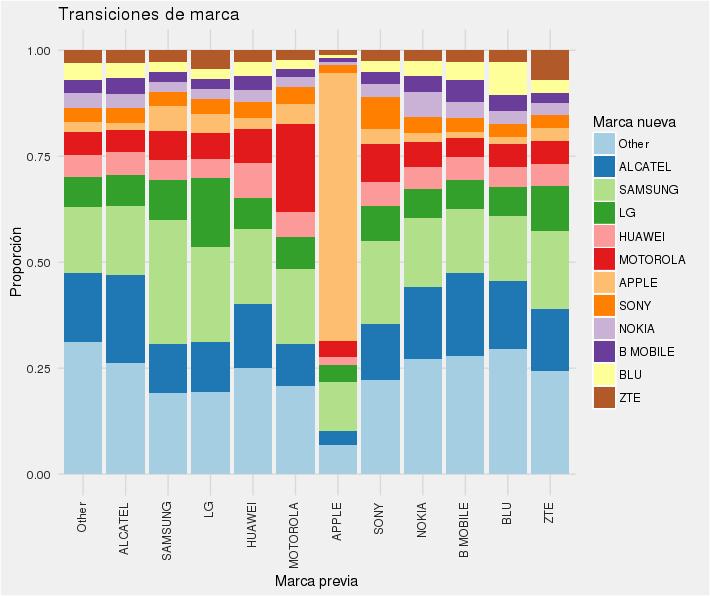
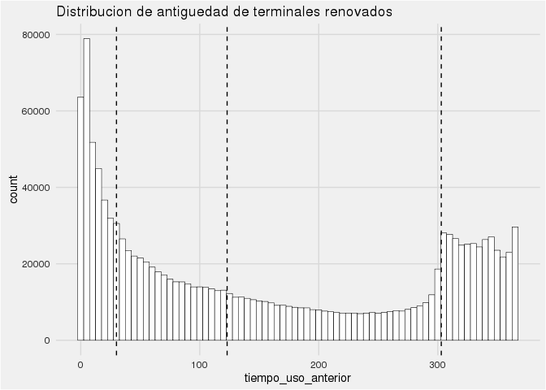
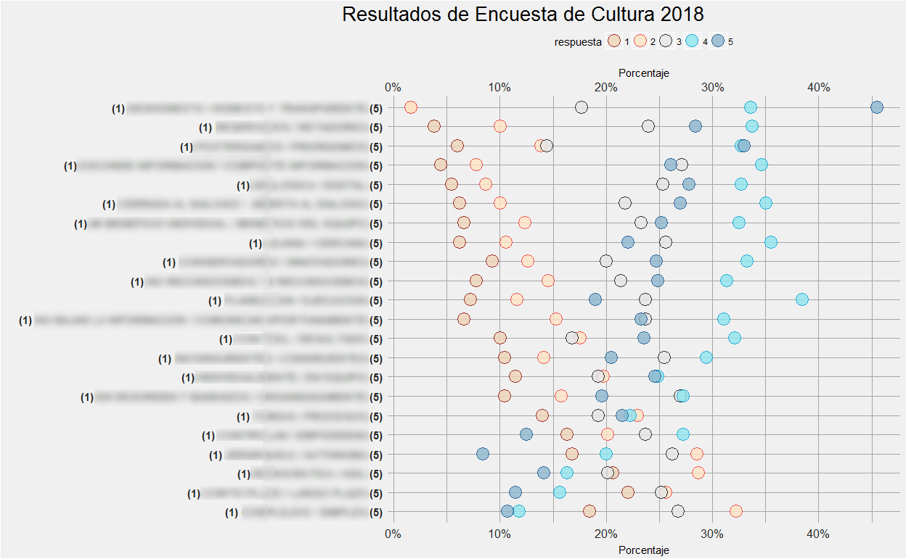
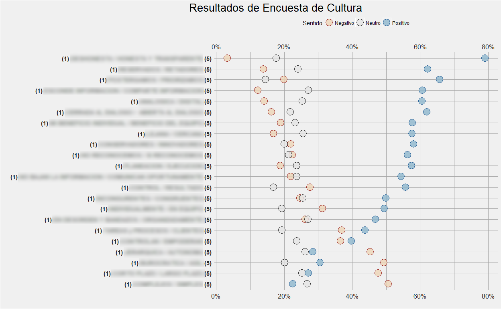
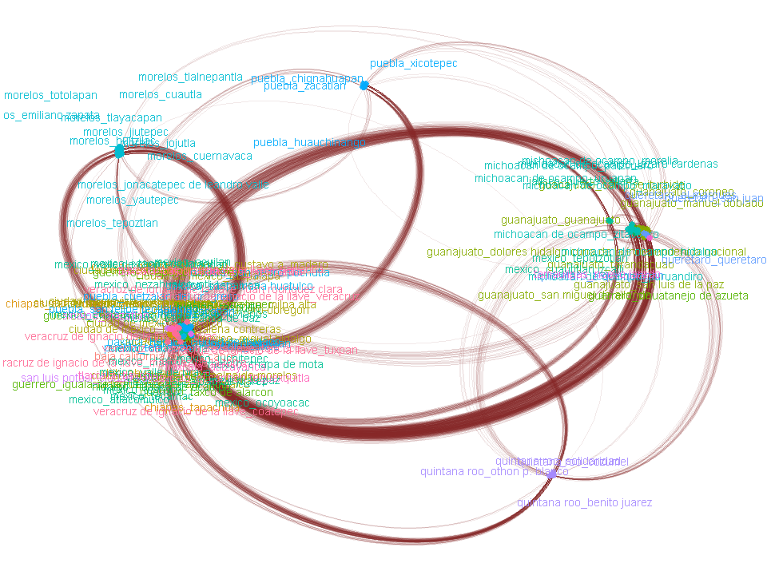
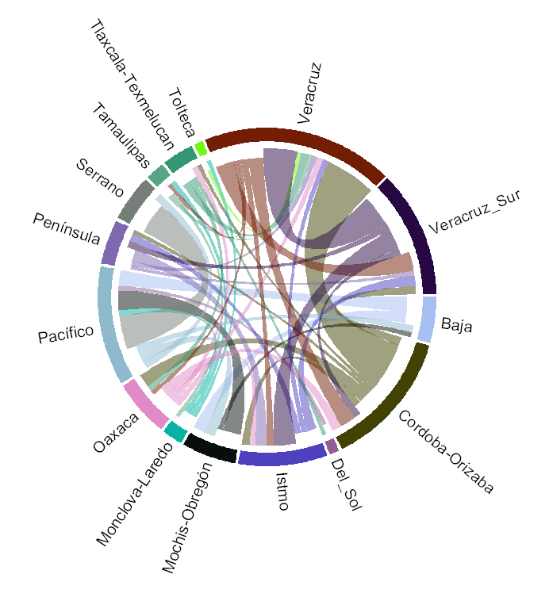
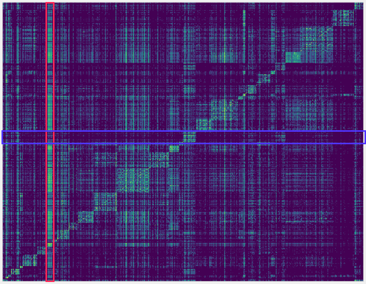
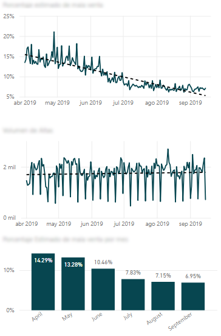
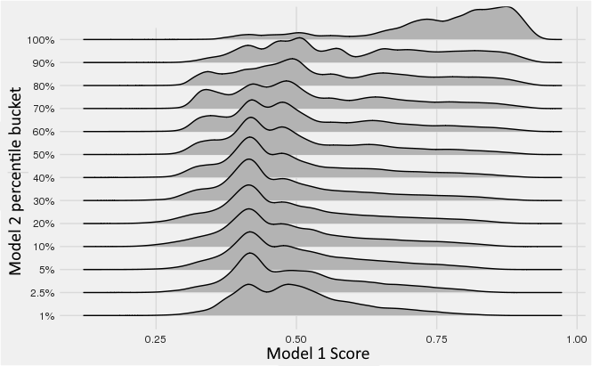

## Basic Viz Portfolio

This is a simple collection of some data viz that I'm able to share, product of real projects that I either find interesting or somewhat appealing.

## Mobile Device transitions

The project's aim was to characterize and predict when a person will update his mobile device (smartphone). Over the course of the project some interesting visualizations were produced.

### Brand Loyalty

This graph shows the proportion of brand transitions on mobile phone changes. On the rows the origin brand is displayed and the proportion of destination brand is displayed in the size of the bar. Brands are coded by color. It is notable that Apple users have by far the greatest brand loyalty while Samsung and Motorola have the most brand loyalty among Android Devices aditionally Samsung seems the most common brand to replace a current android device with, and with lesser measure Alcatel, particularly coming from lower end devices.

### Time to transition

This histogram explores the distribution of the time a user has had his device before a change. It's notable that when the time aproaches 1 year of age the probability for a change is significantly increased. A counter intuitive result that low age is also (even more so) associated with mobile device change. This was later partly explained by users who we observed had previously made a change to a lower end phone, presumably because it is a temporary device used because of a technical failure or it being lost or stolen.

## Poll results

This project was a simple one: Analyze and visualize the results of a large-ish poll that consisted of questions whose answer ranged between 1 - 5 that qualitatively measured various aspects of company culture.

In this vizualization we see the share (x-axis) of respondents who answered for each option (color) and every question (y-axis) ordered by overal share of "positive result" from this visualization it was easy to identify areas of oportunity (bottom rows) and strengths (top rows) as well as the detail for each option and answer. I think it looks pretty too, the layout was directly inspired form some visualizations seen at fivethirtyeight.com.

This is a simple version of the same plot, where possitive outcomes where aggregated into a single data point. so instead of 5 possible values we only see 3: Negative, Neutral and Positive, it's a less clusttered version of the graphic above.

## Mobility Networks

Next are some vizualizations exploring the mobility of people through geographical regions and the impact it has on some estimates.

The above is only an exploration of different types of layouts visualizing the graph or network generated by mobility data. Nothing much relevant to see here other than the different ways in which a graph can be arranged.

This is a more refined viz of the same type of network using a fixed layout. In this layout, clusters of regions with many common individuals (regions where people usually travel from and to) are displayed. As expected, regions that are close in distance tend to be clustered but others that are not necessarily close geographically sometimes appear in the same cluster (zones associated with tourism and bigger cities for instance).

Another way of visualizing (weighted) networks is through this type of circleplot where we can see the proportion of origin-destination pairs as the width of an arc shape we can immediately identify the most common destination from any origin as well as the most common origin for every destination.

This heatmap-type plot explore the relation ships between a marginal change of value in a multivariate model and the marginal change of the model output (also multivariate) columns are the dependent variables (regions) and rows are the dependent one (the same regions) the diagonal is the effect $x_i$ on $y_i$. The the intensity of the heatmap at row $i$ column $j$ reflect the values

$$
\frac{\partial f_{i}}{\partial{x_j}}
$$

of the function

$$
f(x_1, \cdots, x_n) = (y_1, \cdots, y_n)
$$

through this apparently simple visualization we could explore which regions had a mainly local effect (the region affects mainly itself, seen in the intensity of the diagonal) versus which regions have an effect on others (intensity on a column) or which regions are impacted most by the values on others (intensity on the row). Since regions are arranged somewhat geographically we can observe clusters of similarly behaved regions, this corresponds to regions belonging to the same political entity.

## Dashboard Design

The above is a screenshot from a PowerBI dashboard it's design is focused on giving relevant information at a glance rather than overload with statistics. The first panel is the output of a predictive model, it is the projected estimate of a set metric. Second one is a series of a real measured metric and the third one is an aggregation by month of the first. all chars are interactive with tooltips giving the detail of a data point, and further aggregation levels can be explored vial drill down.

## Multimodel Exploration

The above ridgeplot is an exploration of the output scores of two different machine learning models. The problem that this figure is drilling down into is the apparent anti-correlation of both, where it is clearly seen that most of the top scored observations are concentrated within the 99nth percentile of one the other model output (top row).
